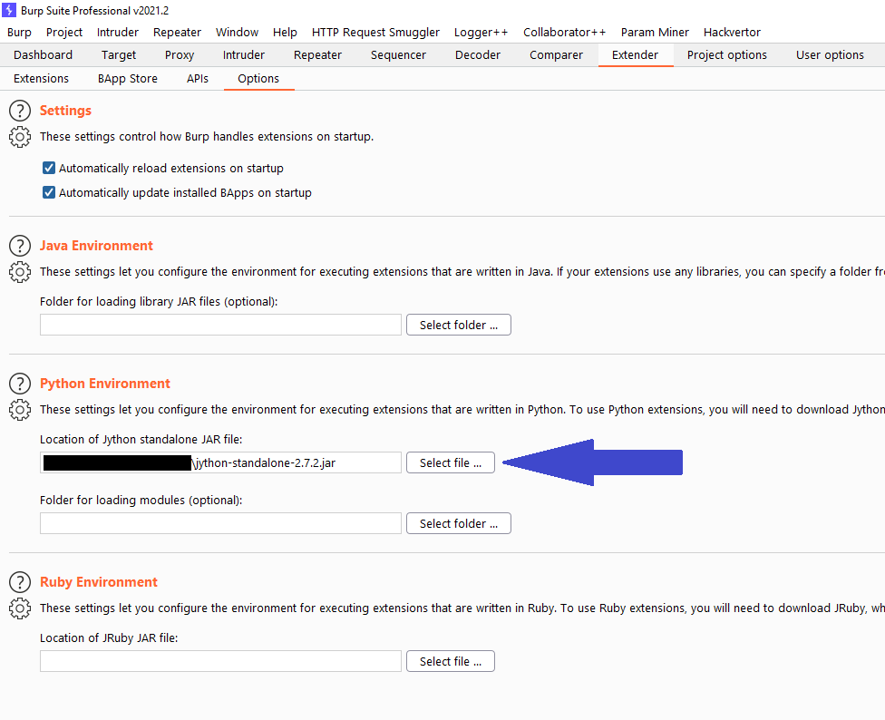
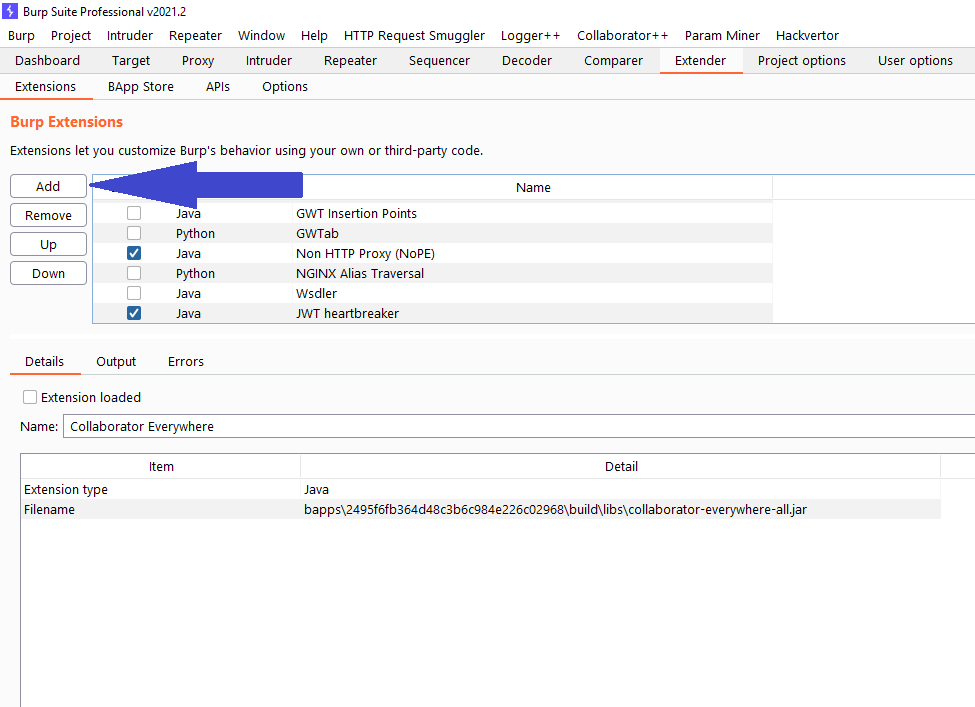
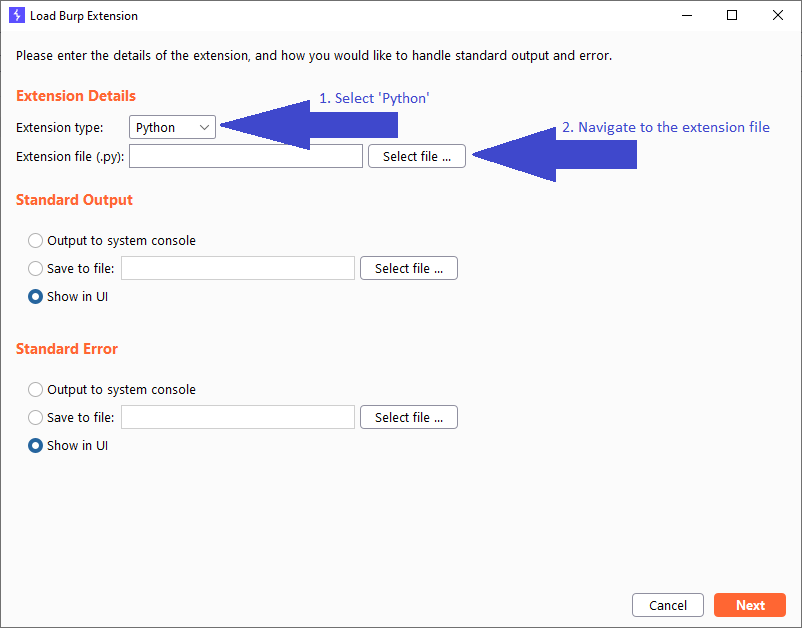
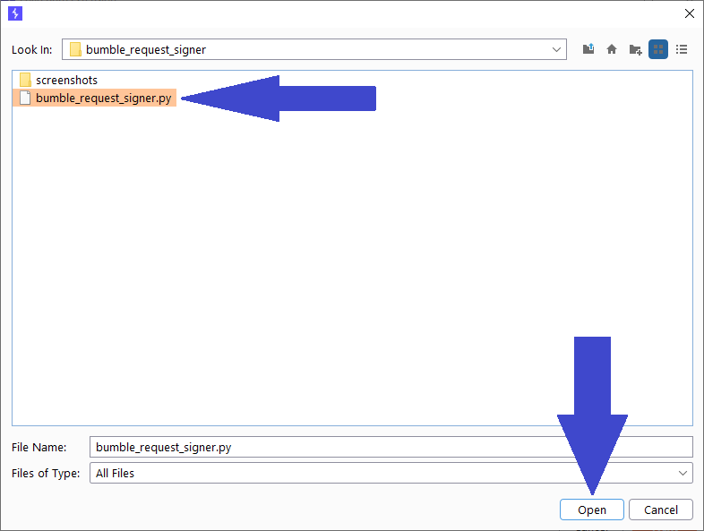
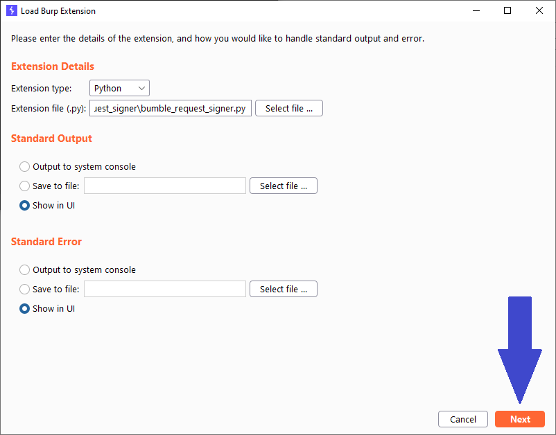

# Bumble Request Signer for Burp Suite
## Summary
This repository contains an extension for [Burp Suite](https://portswigger.net/burp) that intercepts HTTP requests to `*.bumble.com`, executed from either the Repeater or Intruder tab.
The intercepted request is then automatically modified to include (or update, if already present) the required signature header (based on the request body) for Bumble's API.

Requests that are executed without the required signature header, or with an invalid signature, will result in an error response. This extension saves time when working on Bumble's bug bounty program, since you no longer have to manually sign each reqeust after modifying the request body.

## Install
If you've installed Python-based extension before, then you're probably good to go! If not, then please follow the steps below:

0. (Prerequisite) Make sure that you have Burp Suite setup to support Jython-based plugins. If you haven't done so before, please [download the latest standalone Jython jar](https://www.jython.org/download.html) and point Burp Suite to its location:

1. Navigate to the Extender tab and press 'Add':

2. Select 'Python' as the extension type and click on 'Select file ...':

3. Navigate to the root folder of this repository, select `bumble_request_signer.py` and press 'Open':

4. Press 'Next':

5. Congratulations! You should now see a window telling you that the extension has loaded successfully. You may close this window and continue to use Burp Suite as you normally would. Keep in mind that the extension currently only works for requests originating from the Request and Intruder tabs. Furthermore, functionality is limited to `https://*.bumble.com`.

## Issues
If you run into any issues or if you have suggestions for improvements, feel free to open an issue or create a pull request!

## License
See [LICENSE.md](LICENSE.md).
